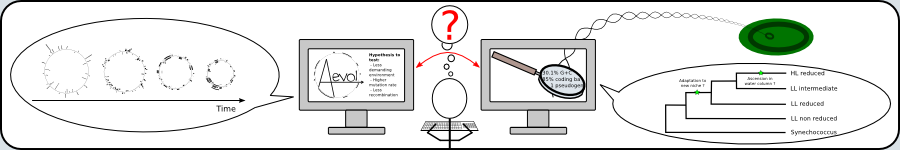

# Research

Since January 2015, I'm principally studing [gut microbiota](#gut_microbiota) 
using metagenomic and metatranscriptomic approaches. Before, I worked during my 
PhD on [reductive genome evolution](#reductive_genome_evolution) of 
*Prochlorococus* with *in silico* experimental evolution and comparative genomic 
approoaches.

---

## Gut microbiota 

metagenomics/metatranscriptomics

why? how? project? 

ASaiM? other projects (Rejane, Clémence, Thierry)?

illustration?

technological choices

## Reductive genome evolution

what is it? NRM?

Prochlorococcus: ovni

approaches --> PhD thesis

### *In silico* experimental evolution

principle

aevol

methodology (illustration): publi + lien vers page publi

### Comparative genomics and phylogeny

Approaches? why phylogeny?

methods? results? 

illustration from thesis

### Proposed hypothetic history

illustration